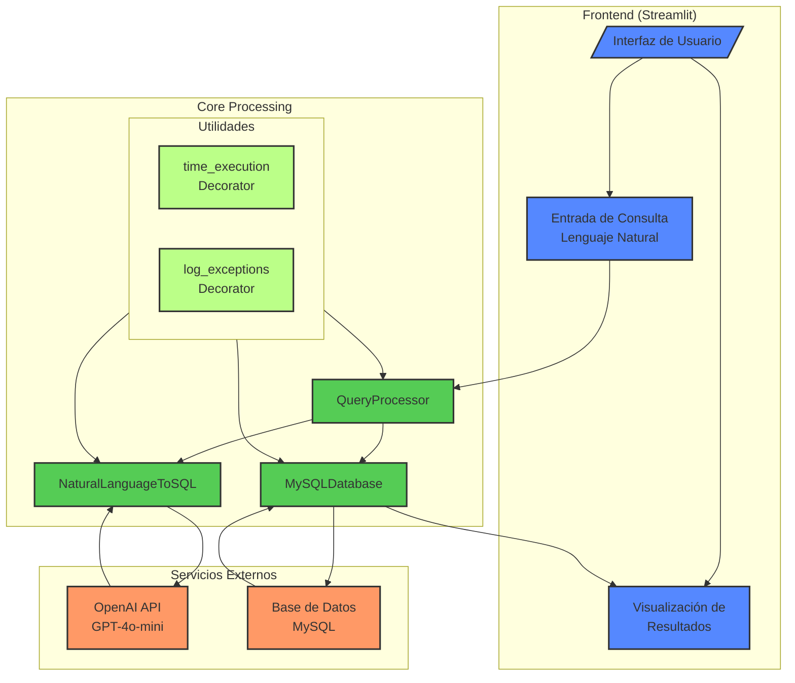

```mermaid
flowchart TB
    subgraph Frontend["Frontend (Streamlit)"]
        UI[/"Interfaz de Usuario"/]
        Query["Entrada de Consulta\nLenguaje Natural"]
        Results["Visualización de\nResultados"]
        UI --> Query
        UI --> Results
    end

    subgraph Core["Core Processing"]
        QP["QueryProcessor"]
        NLS["NaturalLanguageToSQL"]
        DB["MySQLDatabase"]
        
        subgraph Utils["Utilidades"]
            TD["time_execution\nDecorator"]
            LD["log_exceptions\nDecorator"]
        end
    end

    subgraph ExternalServices["Servicios Externos"]
        OpenAI["OpenAI API\nGPT-4o-mini"]
        MySQL["Base de Datos\nMySQL"]
    end

    Query --> QP
    QP --> NLS
    NLS --> OpenAI
    OpenAI --> NLS
    QP --> DB
    DB --> MySQL
    MySQL --> DB
    DB --> Results

    Utils --> QP
    Utils --> NLS
    Utils --> DB

    classDef external fill:#f96,stroke:#333,stroke-width:2px
    classDef frontend fill:#58f,stroke:#333,stroke-width:2px
    classDef core fill:#5c5,stroke:#333,stroke-width:2px
    classDef utils fill:#bf8,stroke:#333,stroke-width:2px

    class OpenAI,MySQL external
    class UI,Query,Results frontend
    class QP,NLS,DB core
    class TD,LD utils
```